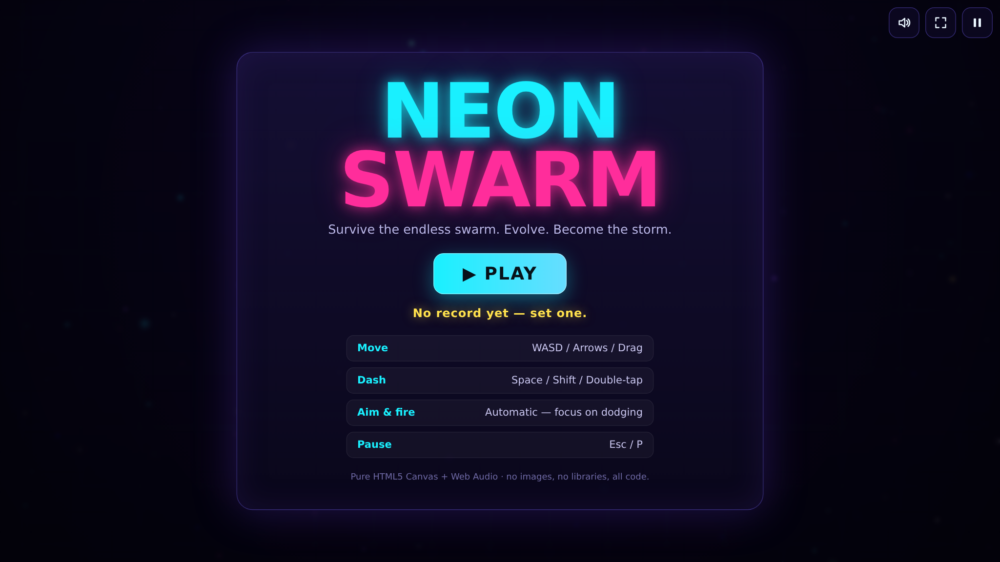
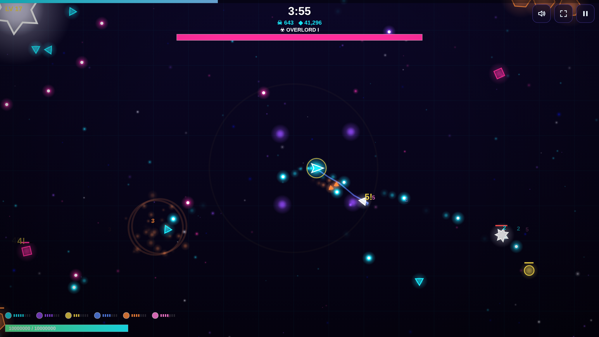
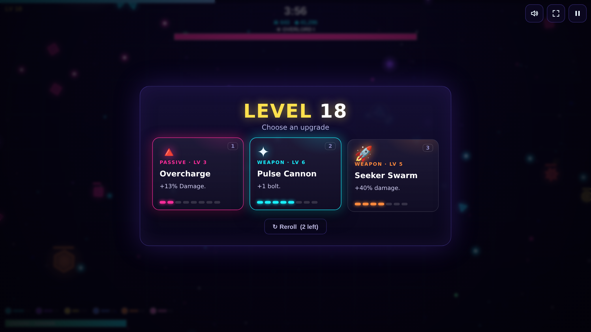

<div align="center">

# ⚡ NEON SWARM ⚡

### A synthwave bullet-heaven survival game — built from scratch with nothing but a `<canvas>` and code.

<a href="https://omargamer2010.github.io/"></a>

[](https://omargamer2010.github.io/)


</div>

---

> **Survive the endless swarm. Evolve. Become the storm.**
>
> You're a lone shard of light in a collapsing neon void. Thousands of shadow-creatures
> pour in from the dark. You don't aim — your weapons fire themselves. Your only job is to
> **dodge, weave, and choose what you become** as you level up. How long can you last?

Every pixel is drawn with the HTML5 Canvas 2D API. Every sound — the lasers, the explosions,
and the entire generative synthwave soundtrack — is **synthesized live in your browser** with
the Web Audio API. There are **no images, no sound files, and no libraries.** Just one HTML
file, one stylesheet, and ~1,500 lines of hand-written JavaScript.

## ▶ Play

| | |
|---|---|
| 🌐 **Online** | **[omargamer2010.github.io](https://omargamer2010.github.io/)** *(once GitHub Pages is enabled — see below)* |
| 💻 **Locally** | Clone the repo and open `index.html` in any modern browser. That's it. No build step, no server. |
| 📱 **Mobile** | Works on phones and tablets — a virtual joystick and dash button appear automatically. |

<div align="center">


</div>

## 🎮 Controls

| Action | Keyboard / Mouse | Touch |
|---|---|---|
| **Move** | `WASD` / Arrow keys, or hold the mouse | Drag anywhere (virtual joystick) |
| **Dash** (i-frames) | `Space` / `Shift` | Double-tap, or the **»** button |
| **Pick upgrade** | `1` `2` `3`, or click; `←/→` + `Enter`; `R` to reroll | Tap a card |
| **Pause** | `Esc` / `P` | ⏸ button |
| **Mute / Fullscreen** | `M` / `F` | 🔊 / ⛶ buttons |

Your weapons **auto-target** the nearest enemies, so the whole game is about **positioning and survival.**

## ✨ Features

🌀 **A growing arsenal — 7 distinct weapons**, each upgradeable through ~7 levels:
| Weapon | What it does |
|---|---|
| **Pulse Cannon** | Auto-fires homing-ish bolts at the nearest foes; gains extra bolts & pierce |
| **Halo Blades** | Blades orbit you, shredding anything they touch |
| **Shock Pulse** | Periodic expanding shockwave with knockback |
| **Arc Lightning** | Bolts that chain between clustered enemies |
| **Seeker Swarm** | Homing missiles that explode in a blast radius |
| **Photon Lance** | Piercing beams of light that skewer rows of enemies |
| **Cryo Field** | A chilling aura that slows and damages the horde |

🔺 **12 passive upgrades** — damage, attack speed, area, crit, regen, armor, magnet range, XP gain, luck and more. Every run builds a different character.

👾 **8 enemy archetypes + escalating bosses** — drifters, rushers, spiraling weavers, splitters that fragment on death, ranged shooters, armored tanks, kamikaze bombers, and giant **OVERLORD** bosses with radial bullet-storms and minion summons.

🎚️ **A difficulty director** that ramps spawn rate, enemy stats, pack-bursts and elites the longer you survive — and a **boss every 2½ minutes.**

💥 **Game feel / "juice":** screen shake, hit-stop, additive neon bloom, particle explosions, floating crit numbers, parallax starfield, combo multiplier, magnet/heal/bomb pickups, low-HP vignette, and a slow-motion-free responsive 60 fps loop.

🎵 **A generative soundtrack** that gets denser and faster as the on-screen pressure rises — bass, arpeggio, pad and a drum machine, all scheduled on the Web Audio clock.

🏆 **Persistent high scores** saved to `localStorage`.

## 🛠️ Under the hood

This project is a little love letter to "what can the browser do with *nothing*?"

- **Zero dependencies, zero assets.** No frameworks, no sprite sheets, no `.mp3`s. Open the file and it runs.
- **Procedural audio engine** (`js/audio.js`) — SFX are tiny synth patches (oscillators + noise + envelopes); the music is a 4-bar synthwave loop generated by a look-ahead scheduler with adjustable intensity.
- **Spatial-hash broad-phase** collision so hundreds of enemies, projectiles and pickups stay smooth — the grid is rebuilt each frame and queried by every weapon.
- **Object-pool-friendly particle system** with additive-blend glow sprites cached per color for cheap bloom.
- **Data-driven weapons & upgrades** — each weapon is a self-contained behaviour object; the level-up card system weights a pool of new weapons, weapon upgrades and passives (nudged by your *Luck* stat).
- **Responsive & input-agnostic** — one render path serves desktop (keyboard/mouse) and mobile (DPR-aware canvas, touch joystick, safe-area insets).

```
omargamer2010/
├── index.html        # page shell + HTML menu overlays
├── css/style.css     # synthwave styling for the shell & menus
├── js/
│   ├── audio.js      # procedural SFX + generative music (Web Audio)
│   └── game.js       # the whole game: loop, entities, weapons, AI, render
└── assets/           # README screenshots (the game itself ships no images)
```

## 💡 Tips

- **Keep moving.** Standing still is death. Carve the swarm into a stream behind you.
- **Don't over-collect.** Grab XP gems with intent — leveling mid-swarm pauses the action so you can breathe.
- **Save your dash** for when you're boxed in; the i-frames let you phase through a wall of enemies.
- **Build a theme.** Stacking *Area* + *Shock Pulse/Cryo* makes you a damage aura; *Crit* + *Photon Lance* deletes bosses.
- **Pickups matter:** 🟢 heal, 🔵 magnet (vacuums every gem), 🟠 bomb (clears the screen).

## 🚀 Enabling the live demo (GitHub Pages)

This repo includes a workflow that publishes the game automatically. To switch it on:

1. Go to **Settings → Pages**.
2. Under **Build and deployment → Source**, choose **GitHub Actions**.
3. Push to `main` (or run the *Deploy to GitHub Pages* workflow manually).

Because this is a `username/username` repository, the game will be served at
**`https://omargamer2010.github.io/`**.

## 📄 License

Released under the [MIT License](LICENSE) — do whatever you like, attribution appreciated.

<div align="center">

*Made with `requestAnimationFrame`, a lot of `Math.sin`, and zero external files.*

**[▶ Play NEON SWARM](https://omargamer2010.github.io/)**

</div>
